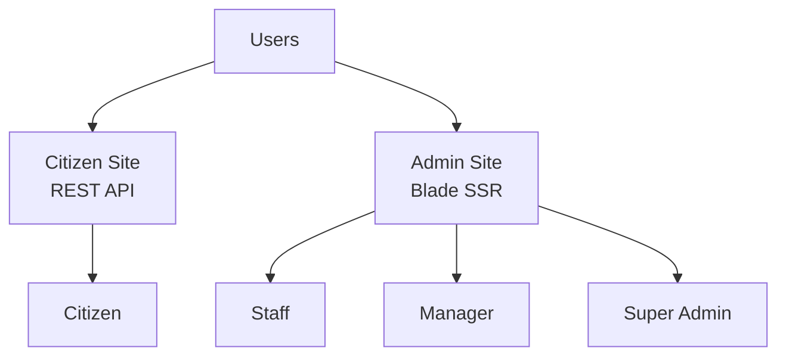
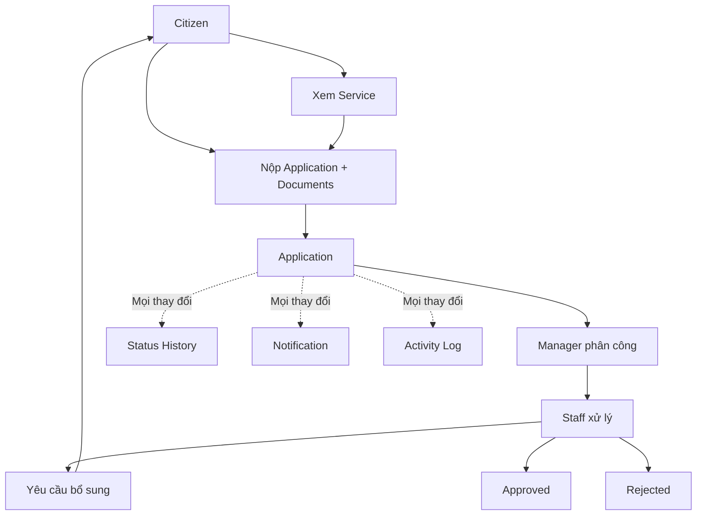

# Public Service Management System

## 1. Hệ thống này làm gì?

Public Service Management System là hệ thống quản lý dịch vụ công trực tuyến.

Thay vì người dân phải thực hiện quy trình thủ công:

> Đến cơ quan → Lấy mẫu → Nộp giấy tờ → Chờ xử lý → Quay lại hỏi kết quả

Hệ thống số hóa quy trình thành:

> Chọn dịch vụ → Nộp hồ sơ trực tuyến → Cán bộ xử lý → Theo dõi trạng thái → Nhận kết quả

Ví dụ về các dịch vụ công:

- Cấp giấy phép xây dựng.
- Đăng ký hoặc xác nhận giấy tờ.
- Các thủ tục hành chính khác.

## 2. Các nhóm người dùng

Nhìn tổng quan, người dùng được chia theo hai khu vực sử dụng độc lập:



- **Citizen Site** phục vụ Citizen thông qua REST API.
- **Admin Site** phục vụ Staff, Manager và Super Admin thông qua giao diện
  server-side rendering bằng Blade.
- Hai khu vực dùng chung hệ thống người dùng nhưng phải được tách biệt về luồng
  đăng nhập, giao diện và quyền truy cập.

### Citizen - Người dân

- Đăng ký, đăng nhập và đăng xuất.
- Xem danh sách dịch vụ công.
- Xem yêu cầu của từng dịch vụ.
- Nộp hồ sơ và tải lên tài liệu.
- Theo dõi tình trạng hồ sơ.
- Bổ sung tài liệu khi được yêu cầu.
- Nhận kết quả và thông báo.

### Staff - Cán bộ

- Nhận các hồ sơ được phân công.
- Kiểm tra hồ sơ và tài liệu.
- Xử lý hồ sơ.
- Yêu cầu người dân bổ sung tài liệu.
- Cập nhật kết quả xử lý.

### Manager - Quản lý

- Phân công hoặc chuyển hồ sơ cho Staff.
- Theo dõi tiến độ xử lý.
- Phê duyệt hoặc từ chối hồ sơ theo quyền hạn.

### Super Admin

- Quản lý người dùng và Staff.
- Quản lý Department.
- Quản lý các Service.
- Theo dõi toàn bộ Application.
- Xem Activity Log.
- Import và export dữ liệu.

## 3. Đối tượng trung tâm của hệ thống

Đối tượng quan trọng nhất là **Application - Hồ sơ dịch vụ công**.

Một hồ sơ liên kết các đối tượng:

> Citizen → Service → Application → Staff/Department

Ví dụ: Nguyễn Văn A chọn dịch vụ cấp giấy phép xây dựng, tải lên các giấy tờ cần
thiết và tạo hồ sơ có mã `HS-20260811-00001`. Sau đó, hồ sơ được chuyển cho cơ
quan hoặc cán bộ phụ trách xử lý.

## 4. Workflow chính

Luồng xử lý quan trọng nhất:

```text
Citizen chọn Service
→ Nộp Application + Documents
→ Received
→ Manager phân công Staff
→ Processing
→ Approved / Rejected
```

Nếu hồ sơ thiếu giấy tờ:

```text
Processing
→ Supplement Required
→ Citizen bổ sung tài liệu
→ Processing
→ Approved / Rejected
```

Mọi thay đổi trạng thái đều phải được lưu lại trong lịch sử xử lý.

## 5. Ví dụ end-to-end

1. Citizen A đăng nhập.
2. Citizen chọn dịch vụ cấp giấy phép xây dựng.
3. Citizen xem yêu cầu và tải lên tài liệu PDF.
4. Citizen nộp hồ sơ; hệ thống sinh mã hồ sơ.
5. Manager nhìn thấy hồ sơ mới.
6. Manager phân công hồ sơ cho Staff B.
7. Staff B kiểm tra hồ sơ.
8. Nếu thiếu giấy tờ, Staff yêu cầu Citizen bổ sung.
9. Citizen tải lên tài liệu bổ sung.
10. Staff tiếp tục xử lý.
11. Hồ sơ được phê duyệt.
12. Citizen nhận thông báo và xem kết quả.

Timeline Citizen nhìn thấy:

> Received → Processing → Supplement Required → Processing → Approved

Đây là luồng nghiệp vụ cốt lõi của toàn dự án.

## 6. Hai phần giao diện chính

### Citizen Site

Citizen Site đi theo hướng REST API và phục vụ các nhóm chức năng:

- Services.
- Applications.
- Profile.
- Documents.
- Notifications.

### Admin Site

Admin Site đi theo hướng Laravel SSR/Blade và phục vụ các nhóm chức năng:

- Users.
- Staff.
- Departments.
- Services.
- Applications.
- Logs.

Cả hai khu vực dùng chung kiến trúc xử lý:

> Laravel Backend → Business Logic → PostgreSQL

## 7. Các phần quan trọng cần làm đúng

Thứ tự ưu tiên nghiệp vụ:

1. **Application Workflow**: Hồ sơ phải đi đúng quy trình và không được thay đổi
   trạng thái tùy tiện.
2. **Authorization**: Citizen chỉ được xem hồ sơ của mình; Staff chỉ được xử lý
   hồ sơ thuộc phạm vi được cấp quyền; Manager và Super Admin có quyền cao hơn
   theo trách nhiệm nghiệp vụ.
3. **Documents**: Tài liệu phải được gắn đúng Application và không được để người
   không có quyền truy cập.
4. **History/Audit**: Hệ thống phải xác định được hồ sơ từng trải qua trạng thái
   nào, ai xử lý và xử lý vào thời điểm nào.
5. **Data Consistency**: Các thao tác approve, reject và assign phải cập nhật dữ
   liệu đồng bộ, tránh sai lệch giữa trạng thái hiện tại và lịch sử.

## 8. Sơ đồ tổng quan



## Kết luận

Đây không phải là một website CRUD đơn thuần để quản lý user hoặc service. Đây
là hệ thống quản lý toàn bộ vòng đời của một hồ sơ dịch vụ công, từ khi người
dân nộp hồ sơ cho đến khi cơ quan xử lý và trả kết quả.

Vì vậy, **Application và Processing Workflow là trung tâm**; các feature còn lại
đều đóng vai trò hỗ trợ cho luồng nghiệp vụ này.
