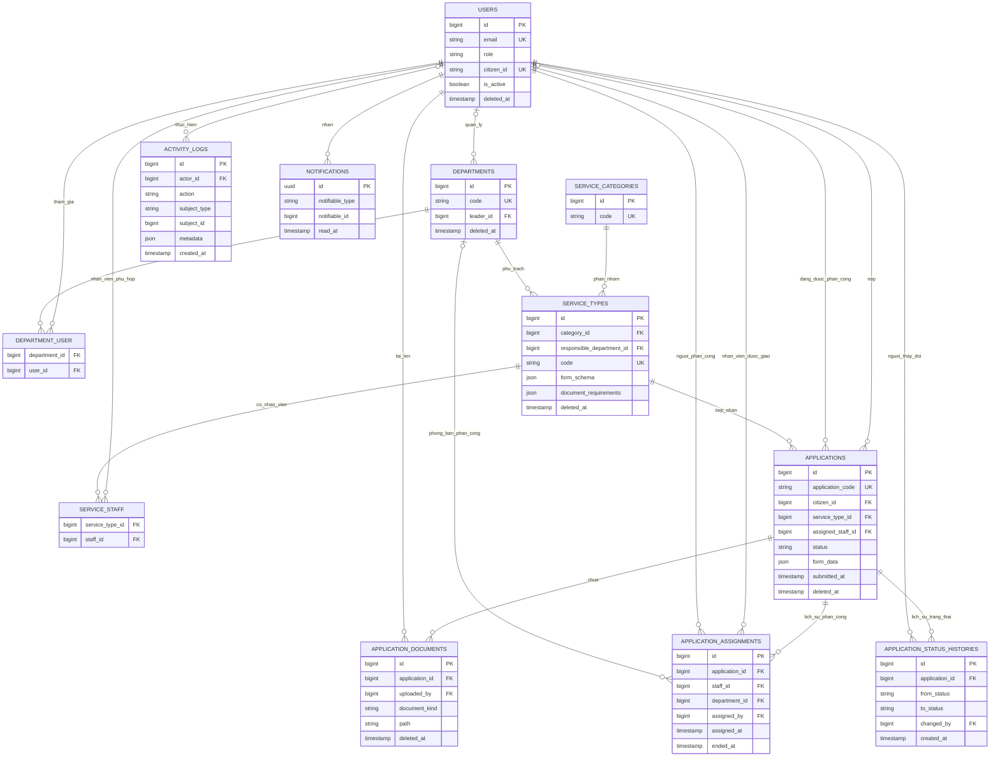

# Thiết kế cơ sở dữ liệu

## Phạm vi và quy ước

Lược đồ này là nền tảng cơ sở dữ liệu dùng chung cho Hệ thống Quản lý Dịch vụ
Công. Tài liệu chỉ bao gồm cấu trúc dữ liệu nghiệp vụ, các mối quan hệ, ràng buộc
và những bảng hạ tầng của Laravel. Controller, quy trình xử lý, chức năng tải tệp,
thông báo và cơ chế tự động ghi nhật ký hoạt động sẽ được triển khai trong các
feature Spec-Kit sau.

Migration sử dụng Laravel Schema Builder và chỉ hỗ trợ PostgreSQL/Supabase. Các
giá trị cố định được lưu trong cột `VARCHAR` và được cast sang PHP backed enum
thay vì sử dụng kiểu enum riêng của PostgreSQL. Khóa chính tuân theo quy ước
`BIGINT` của Laravel.

`Application` là thực thể trung tâm vì nó liên kết công dân, dịch vụ được chọn,
dữ liệu đã khai báo, metadata của tài liệu đã tải lên, trạng thái xử lý hiện tại,
lịch sử phân công và dòng thời gian thay đổi trạng thái.

## Các bảng nghiệp vụ

### `users`

Lưu công dân và người dùng nội bộ. `email` và mã định danh nghiệp vụ không bắt
buộc `citizen_id` là duy nhất. Cột `role` được cast sang `UserRole`. Thông tin hồ
sơ và tùy chọn nhận thông báo được đặt chung trong bảng này để giữ cho thiết kế
ban đầu đơn giản. `is_active` cho phép vô hiệu hóa quyền truy cập mà không xóa tài
khoản, trong khi soft delete giúp bảo toàn các tham chiếu từ hồ sơ dịch vụ công.

Cần phân biệt: `users.citizen_id` là mã định danh công dân, còn
`applications.citizen_id` là khóa ngoại dạng số tham chiếu đến `users.id`.

### `departments` và `department_user`

`departments` lưu các đơn vị tổ chức nội bộ. `code` là duy nhất và `leader_id` có
thể tham chiếu đến một manager trong `users`. `department_user` là bảng trung
gian many-to-many có timestamps, đồng thời bảo đảm cặp
`(department_id, user_id)` là duy nhất.

### `service_categories`

Nhóm các dịch vụ công thành những danh mục ổn định. `code` là mã định danh duy
nhất, dùng được cho máy đọc. Một danh mục có nhiều loại dịch vụ.

### `service_types` và `service_staff`

`service_types` định nghĩa một dịch vụ công và tham chiếu đến danh mục cùng phòng
ban chịu trách nhiệm. `code` là duy nhất. `service_staff` xác định các nhân viên
đủ điều kiện xử lý dịch vụ và bảo đảm cặp `(service_type_id, staff_id)` là duy
nhất.

`form_schema` và `document_requirements` sử dụng JSON vì trường biểu mẫu và tập
tài liệu bắt buộc thay đổi theo từng dịch vụ. Các thuộc tính ổn định cần tìm kiếm
như tên, lệ phí, thời gian xử lý, danh mục và phòng ban vẫn được lưu trong các cột
quan hệ.

### `applications`

Lưu ảnh chụp trạng thái hiện tại của hồ sơ do công dân gửi. `application_code` là
mã hồ sơ công khai và duy nhất; cơ chế sinh mã sẽ được triển khai sau. Các khóa
ngoại liên kết công dân, loại dịch vụ và nhân viên đang được phân công nếu có.
`status` được cast sang `ApplicationStatus`, còn `form_data` chứa các giá trị
tương ứng với `form_schema` động của dịch vụ đã chọn.

Các index hỗ trợ tra cứu theo mã hồ sơ công khai, công dân, loại dịch vụ, nhân
viên đang xử lý, trạng thái, thời điểm nộp, dòng thời gian của công dân và hàng đợi
xử lý theo dịch vụ.

### `application_documents`

Chỉ lưu metadata của tài liệu. Tệp nhị phân được lưu trên Laravel filesystem
disk. Mỗi bản ghi tham chiếu đến hồ sơ và người tải lên. `document_kind` được cast
sang `DocumentKind`. Soft delete cho phép thu hồi tài liệu mà không xóa dấu vết
kiểm toán.

### `application_assignments`

Lưu lịch sử phân công theo hướng chỉ bổ sung bản ghi mới. Mỗi bản ghi xác định hồ
sơ, nhân viên được phân công, phòng ban nếu có, người thực hiện phân công, thời
điểm phân công, thời điểm kết thúc nếu có và ghi chú.

`applications.assigned_staff_id` được giữ lại có chủ đích để truy xuất nhanh
người đang xử lý. `application_assignments` lưu toàn bộ các giai đoạn phân công
phục vụ kiểm toán và báo cáo.

### `application_status_histories`

Dòng thời gian trạng thái chỉ cho phép bổ sung. `from_status` có thể null đối với
sự kiện đầu tiên; `to_status` là bắt buộc. Cả hai giá trị dùng cast
`ApplicationStatus`. Bảng chỉ có `created_at` vì các bản ghi lịch sử không nên bị
cập nhật.

`applications.status` được giữ lại có chủ đích để truy vấn trạng thái hiện tại
hiệu quả. `application_status_histories` giải thích trạng thái hiện tại được hình
thành như thế nào và do ai thay đổi.

### `activity_logs`

Lưu nhật ký kiểm toán tổng quát với người thực hiện không bắt buộc và tham chiếu
dạng polymorphic `(subject_type, subject_id)`. `metadata` lưu ngữ cảnh có cấu
trúc phụ thuộc vào từng hành động. Nền tảng hiện tại chưa triển khai cơ chế ghi
nhật ký tự động.

### Các bảng hạ tầng Laravel

- `password_reset_tokens` và `sessions` hỗ trợ xác thực bằng Laravel session.
- `personal_access_tokens` hỗ trợ xác thực API bằng Sanctum.
- `notifications` sử dụng lược đồ database notification tiêu chuẩn của Laravel.
- `cache` và `cache_locks` hỗ trợ database cache store.
- `jobs`, `job_batches` và `failed_jobs` hỗ trợ database queue.

## Các ràng buộc và index chính

- Giá trị duy nhất: email người dùng, mã công dân không bắt buộc, mã phòng ban,
  mã danh mục, mã dịch vụ và mã hồ sơ.
- Tính duy nhất của bảng trung gian: `(department_id, user_id)` và
  `(service_type_id, staff_id)`.
- Index của hồ sơ: công dân, loại dịch vụ, nhân viên được phân công, trạng thái,
  thời điểm nộp, `(citizen_id, submitted_at)` và `(status, service_type_id)`.
- Index lịch sử: `(application_id, assigned_at)` và
  `(application_id, created_at)`.
- Index nhật ký hoạt động: người thực hiện, hành động, thời điểm tạo và
  `(subject_type, subject_id)`.
- Khóa ngoại bảo đảm các tham chiếu hợp lệ nhưng không mã hóa quy tắc phân quyền
  theo vai trò nghiệp vụ ngay trong cơ sở dữ liệu.

## Chiến lược xóa dữ liệu

- Soft delete: `users`, `departments`, `service_types`, `applications` và
  `application_documents`.
- Bản ghi bảng trung gian được xóa cascade khi phòng ban, người dùng hoặc loại
  dịch vụ liên kết bị xóa vật lý.
- Các tham chiếu hiện tại không bắt buộc như trưởng phòng, nhân viên được phân
  công, phòng ban phân công và người thực hiện hoạt động sẽ chuyển thành `NULL`
  khi bản ghi liên quan bị xóa vật lý, trong trường hợp việc giữ bản ghi xung
  quanh quan trọng hơn giữ liên kết không bắt buộc.
- Các tham chiếu cốt lõi của hồ sơ, tài liệu, phân công và lịch sử trạng thái hạn
  chế xóa vật lý. Dữ liệu lịch sử dịch vụ công không được biến mất chỉ vì người
  dùng, phòng ban hoặc dịch vụ bị xóa.
- Danh mục dịch vụ không thể bị xóa vật lý khi vẫn còn loại dịch vụ tham chiếu.

Hoạt động thông thường của ứng dụng nên ưu tiên vô hiệu hóa hoặc soft delete. Xóa
vật lý chỉ là thao tác quản trị hoặc bảo trì cơ sở dữ liệu trong trường hợp đặc
biệt.

## Backed enum

### `UserRole`

- `citizen`
- `staff`
- `manager`
- `super_admin`

### `ApplicationStatus`

- `received`
- `processing`
- `supplement_required`
- `approved`
- `rejected`

### `DocumentKind`

- `submission`
- `supplement`
- `result`

Cơ sở dữ liệu lưu các giá trị dưới dạng chuỗi để migration có tính di động và
việc thay đổi enum trong tương lai không yêu cầu chỉnh sửa kiểu enum đặc thù của
cơ sở dữ liệu.

## Dữ liệu seed cho môi trường phát triển

`DatabaseSeeder` tạo một super admin, một manager, hai staff, hai citizen, ba
phòng ban, năm danh mục và năm loại dịch vụ. Không tạo dữ liệu hồ sơ. Các tài
khoản phát triển sử dụng mật khẩu dễ nhận biết `password` và địa chỉ email có
đuôi `.test`; tuyệt đối không sử dụng chúng làm thông tin đăng nhập production.

## Sơ đồ quan hệ thực thể

