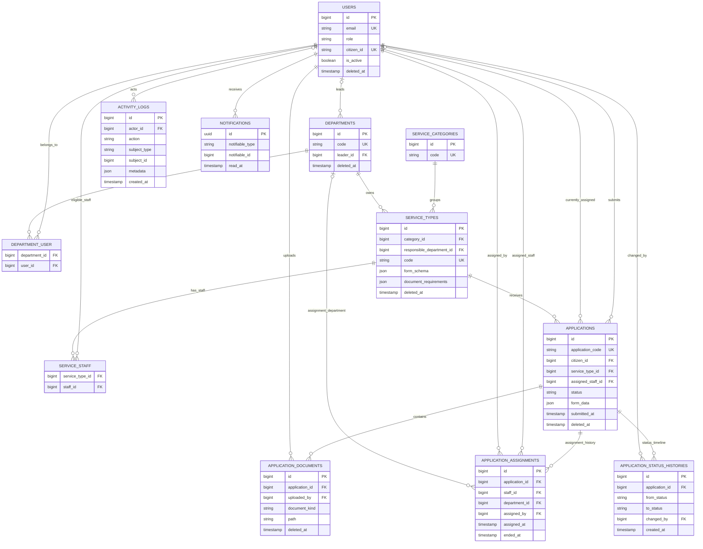

# Database Design

## Scope and conventions

This schema is the shared database foundation for the Public Service Management System. It contains domain data structures, relationships, constraints, and Laravel infrastructure tables only. Controllers, workflow behavior, file upload behavior, notifications, and activity logging automation belong to later Spec-Kit features.

Migrations use Laravel Schema Builder with PostgreSQL/Supabase as the only supported database. Fixed values are stored in `VARCHAR` columns and cast to PHP backed enums instead of PostgreSQL enum types. Primary keys follow Laravel's `BIGINT` convention.

`Application` is the core entity because it connects the citizen, selected service, submitted values, uploaded document metadata, current processing state, assignment history, and status timeline.

## Domain tables

### `users`

Stores citizens and internal users. `email` and the optional business identifier `citizen_id` are unique. The `role` column is cast to `UserRole`. Profile and notification preference columns are shared here to keep the initial design simple. `is_active` disables access without deleting the account, while soft deletion preserves references from public-service records.

Note that `users.citizen_id` is a public identity value, while `applications.citizen_id` is a numeric foreign key to `users.id`.

### `departments` and `department_user`

`departments` stores internal organizational units. `code` is unique and `leader_id` optionally references a manager in `users`. `department_user` is the timestamped many-to-many membership table and enforces uniqueness on `(department_id, user_id)`.

### `service_categories`

Groups public services into stable categories. `code` is a unique machine-readable identifier. A category has many service types.

### `service_types` and `service_staff`

`service_types` defines a public service and references its category and responsible department. `code` is unique. `service_staff` identifies eligible staff members and enforces uniqueness on `(service_type_id, staff_id)`.

`form_schema` and `document_requirements` are JSON because fields and required document sets vary by service. Stable searchable attributes such as name, fee, processing time, category, and department remain relational columns.

### `applications`

Stores the current snapshot of a citizen's submitted application. `application_code` is a unique public identifier; generation is intentionally deferred. Foreign keys connect the citizen, service type, and optional current assigned staff member. `status` is cast to `ApplicationStatus`, while `form_data` contains values corresponding to the selected service's dynamic `form_schema`.

Indexes support lookup by public code, citizen, service type, current assignee, status, submission time, citizen timeline, and service work queue.

### `application_documents`

Stores document metadata only. Binary files remain on a Laravel filesystem disk. Each record references its application and uploader. `document_kind` is cast to `DocumentKind`. Soft deletion allows a document to be withdrawn without erasing its audit trail.

### `application_assignments`

Append-oriented assignment history. Each record identifies the application, assigned staff member, optional department, assigning user, assignment time, optional end time, and note.

`applications.assigned_staff_id` is intentionally retained for fast access to the current assignee. `application_assignments` preserves every assignment period for audit and reporting.

### `application_status_histories`

Append-only status timeline. `from_status` is nullable for the first event; `to_status` is required. Both values use `ApplicationStatus` casts. Only `created_at` is present because history rows should not be updated.

`applications.status` is intentionally retained for efficient current-state queries. `application_status_histories` explains how and by whom the current state was reached.

### `activity_logs`

Generic audit records with an optional actor and polymorphic-style `(subject_type, subject_id)` reference. `metadata` stores context whose shape depends on the action. No automatic logging is implemented in this foundation.

### Laravel infrastructure tables

- `password_reset_tokens` and `sessions` support Laravel session authentication.
- `personal_access_tokens` supports Sanctum API authentication.
- `notifications` uses Laravel's standard database notification schema.
- `cache` and `cache_locks` support the database cache store.
- `jobs`, `job_batches`, and `failed_jobs` support the database queue.

## Main constraints and indexes

- Unique: user email, optional user citizen identifier, department code, category code, service code, and application code.
- Pivot uniqueness: `(department_id, user_id)` and `(service_type_id, staff_id)`.
- Application indexes: citizen, service type, assigned staff, status, submitted time, `(citizen_id, submitted_at)`, and `(status, service_type_id)`.
- History indexes: `(application_id, assigned_at)` and `(application_id, created_at)`.
- Activity indexes: actor, action, creation time, and `(subject_type, subject_id)`.
- Foreign keys enforce valid references without encoding role-specific business authorization in the database.

## Delete strategy

- Soft deletes: `users`, `departments`, `service_types`, `applications`, and `application_documents`.
- Pivot rows cascade when a linked department, user, or service type is physically deleted.
- Current optional references such as department leader, assigned staff, assignment department, and activity actor become `NULL` on physical deletion where preserving the surrounding record is more important than retaining the optional link.
- Core application, document, assignment, and status-history references use restricted physical deletion. Historical public-service records must not disappear because a user, department, or service is removed.
- Service categories are protected from physical deletion while referenced by a service type.

Normal application behavior should prefer deactivation or soft deletion. Physical deletion is an exceptional administrative/database maintenance operation.

## Backed enums

### `UserRole`

- `citizen`
- `staff`
- `manager`
- `super_admin`

### `ApplicationStatus`

- `received`
- `processing`
- `supplement_required`
- `approved`
- `rejected`

### `DocumentKind`

- `submission`
- `supplement`
- `result`

The database uses strings so migrations remain portable and future enum changes do not require database-specific enum alterations.

## Development seed data

`DatabaseSeeder` creates one super admin, one manager, two staff members, two citizens, three departments, five categories, and five service types. No applications are seeded. Development accounts use the obvious password `password` and `.test` email addresses; they must never be used as production credentials.

## Entity relationship diagram

