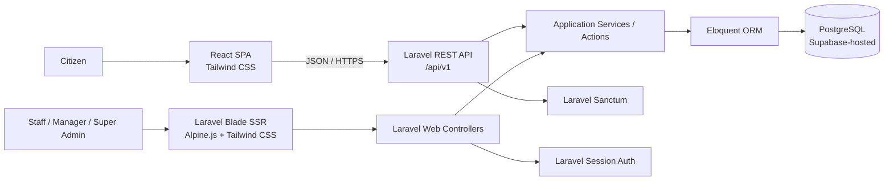

# Technology Stack and Architecture

Tài liệu này mô tả kiến trúc kỹ thuật và các công nghệ được lựa chọn cho
Public Service Management System. Đây là tài liệu sống và cần được cập nhật khi
có thay đổi về kiến trúc, thư viện hoặc hạ tầng.

## 1. Tổng quan kiến trúc

Hệ thống sử dụng kiến trúc hybrid với hai giao diện có cách render khác nhau:

- **Citizen Site** là React SPA, giao tiếp với backend thông qua Laravel REST API.
- **Admin Site** sử dụng Laravel Blade SSR và Alpine.js cho các tương tác nhỏ.
- Cả hai phía dùng chung Laravel backend, business logic, Eloquent models và
  PostgreSQL database.



## 2. Stack công nghệ

| Thành phần | Công nghệ | Trạng thái |
|---|---|---|
| Backend | PHP 8.5 + Laravel 13 | Đang sử dụng |
| Database | PostgreSQL hosted on Supabase | PostgreSQL đã cấu hình; Supabase là môi trường triển khai dự kiến |
| ORM | Laravel Eloquent ORM | Đang sử dụng |
| Citizen Site | React.js + Tailwind CSS, sử dụng Laravel REST API | Đã có bộ khung cơ bản |
| Admin Site | Laravel Blade SSR + Alpine.js + Tailwind CSS | Đã có bộ khung cơ bản |
| API Authentication | Laravel Sanctum, SPA cookie authentication | Đã cấu hình nền tảng; luồng đăng nhập sẽ được bổ sung theo feature |
| Admin Authentication | Laravel session authentication | Sẽ hoàn thiện theo feature authentication |
| Authorization | Middleware + Gates/Policies | Kiến trúc đã chọn; policies sẽ được bổ sung theo nghiệp vụ |
| API Documentation | OpenAPI/Swagger với Scramble | Dự kiến, chưa cài đặt |
| File Storage | Laravel Filesystem, private local storage | Đã cấu hình |
| Notifications | Laravel Notifications + Mail | Kiến trúc đã chọn; chưa có notification nghiệp vụ |
| Background Jobs | Laravel Queue, database driver | Đã cấu hình; chưa có job nghiệp vụ |
| Import/Export | CSV | Dự kiến |
| Backend Testing | PHPUnit + Laravel Feature Tests | Đang sử dụng |
| Additional Testing | Pest | Tùy chọn/dự kiến, chưa cài đặt |
| Frontend Build | Vite | Đang sử dụng |
| Source Control | Git + GitHub | Đang sử dụng |
| Planning | Spec-Kit + Redmine | Đang sử dụng |

## 3. Phân chia trách nhiệm

### Citizen Site

React chịu trách nhiệm render và quản lý giao diện Citizen. Citizen không dùng
Blade để xây dựng các màn hình nghiệp vụ; Blade chỉ cung cấp HTML shell và React
mount point ban đầu.

```text
resources/js/citizen/
├── api/            API client và các hàm gọi Laravel API
├── pages/          Các màn hình theo route
├── components/     Component dùng lại
├── App.jsx         React routes cấp ứng dụng
└── main.jsx        React entry point
```

Citizen gọi các endpoint JSON có version dưới `/api/v1`. Axios được cấu hình để
gửi cookie và CSRF token phục vụ Sanctum SPA authentication.

### Admin Site

Admin được render phía server bằng Blade. Alpine.js chỉ đảm nhiệm các tương tác
nhẹ như dropdown, modal hoặc trạng thái UI cục bộ; không biến Admin thành React
SPA.

```text
resources/views/admin/     Blade templates và layouts
resources/js/admin/        Alpine.js entry point
app/Http/Controllers/Admin/
routes/web.php
```

### Laravel backend

```text
app/Http/Controllers/Api/V1/    Citizen REST API controllers
app/Http/Controllers/Admin/     Admin Blade controllers
app/Http/Requests/Api/V1/       Validation và authorization đầu vào API
app/Http/Resources/Api/V1/      Chuyển dữ liệu thành API response
app/Http/Responses/             Chuẩn response envelope dùng chung
app/Actions/                    Một use case hoặc hành động nghiệp vụ
app/Services/                   Dịch vụ dùng chung hoặc tích hợp bên ngoài
app/Policies/                   Phân quyền trên resource/model
```

API Controller và Admin Controller không nên chứa business logic phức tạp.
Logic dùng chung được đặt trong Actions hoặc Services để hai giao diện có thể tái
sử dụng mà không viết lặp.

## 4. Quy ước REST API

- Base path: `/api/v1`.
- Request và response sử dụng JSON.
- Dùng Form Request cho validation và authorization đầu vào.
- Dùng API Resource để chuyển đổi model/dữ liệu trả về.
- Dùng HTTP status code phù hợp với kết quả xử lý.
- Response thành công theo cấu trúc:

```json
{
  "success": true,
  "message": "Operation completed successfully",
  "data": {}
}
```

- Response thất bại theo cấu trúc:

```json
{
  "success": false,
  "message": "The request could not be processed",
  "errors": {}
}
```

OpenAPI/Swagger bằng Scramble sẽ là nguồn tài liệu endpoint sau khi package này
được cài đặt và cấu hình.

## 5. Authentication và authorization

- Citizen React SPA dùng Sanctum cookie/session authentication và CSRF
  protection; không lưu access token của first-party SPA trong `localStorage`.
- Admin Blade dùng Laravel web session authentication.
- Middleware bảo vệ route theo trạng thái đăng nhập hoặc vai trò.
- Gates/Policies kiểm soát quyền thực hiện hành động trên từng resource.
- React chỉ dùng quyền từ API để điều chỉnh trải nghiệm giao diện; Laravel luôn
  là nơi thực thi kiểm tra quyền cuối cùng.

## 6. Kiểm thử

```text
tests/Feature/Api/      REST API feature tests
tests/Feature/Admin/    Blade SSR/Admin feature tests
tests/Unit/             Unit tests cho logic độc lập
```

PHPUnit và Laravel Feature Tests là công cụ kiểm thử hiện tại. Pest chỉ được ghi
nhận là lựa chọn mở rộng và không được xem là dependency của dự án cho đến khi
được cài đặt chính thức.

## 7. Nguyên tắc cập nhật tài liệu

Khi bổ sung hoặc thay đổi công nghệ:

1. Cập nhật bảng stack và trạng thái tương ứng trong tài liệu này.
2. Cập nhật sơ đồ nếu thay đổi ranh giới giữa Citizen, Admin và backend.
3. Chỉ đánh dấu **Đang sử dụng** sau khi dependency và cấu hình đã có trong
   codebase.
4. Ghi rõ **Dự kiến** đối với công nghệ mới chỉ được thống nhất về mặt thiết kế.
